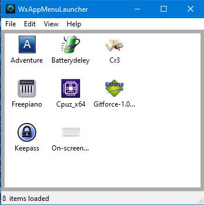

This a implementation of AppMenuLauncher in using WxWidgets.
It was created to be a demonstration and for learning purposes of what WxWidgets can do in terms of GUI interfaces for Windows.

The implementation was described in the post article [Select the best GUI toolkit – part 6: wxWidgets]( https://codehouse.digfish.org/select-the-best-…part-6-wxwidgets/ ). This one is the sixth of a series introduced in  [Selecting the best GUI programming toolkit – First part (planning)](https://codehouse.digfish.org/selecting-the-best-widget-toolkit-1/).

## Running

Clone locally the project, and on VSCode open it. The main script is `wxessay1WxAppMenuLauncher.py`. You can run it from the IDE or from the command line.
If you just want to run the app without an IDE, use the `run*` script according to your platform.
There is an executable for Windows, which you can find in the `releases` section.

